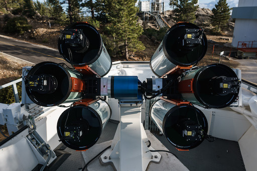

# DDOTI: Gallery

These works are licensed under a [Creative Commons Attribution-ShareAlike 4.0 International License](https://creativecommons.org/licenses/by-sa/4.0/).

The six DDOTI telescopes.

* [Full Resolution](gallery/20190512T182100.jpg)
* Copyright (c) 2019 Alan M. Watson

La maja desnuda; the DDOTI enclosure open at the end of the day.

* [Full Resolution](gallery/20190512T184248.jpg)
* Copyright (c) 2019 Alan M. Watson

La maja vestida; the DDOTI enclosure open and closed at the end of the day.

* [Full Resolution](gallery/20190512T184331.jpg)
* Copyright (c) 2019 Alan M. Watson

The two DDOTI telescope showing the prime-focus CCDs mounted on
their corrector lenses. We park the telescopes pointed slightly below
the northern horizion to keep dust of the corrector lenses.

* [Full Resolution](gallery/20180607T094356.jpg)
* Copyright (c) 2018 Alan M. Watson

The two DDOTI telescope taking evening twilight flats.

* [Full Resolution](gallery/20180607T200102.jpg)
* Copyright (c) 2018 Alan M. Watson

DDOTI (left foreground), [COATLI](http://coatli.astroscu.unam.mx/) (center background), and the 84-cm telescope open at twilight.

* [Full Resolution](gallery/20180607T200502.jpg)
* Copyright (c) 2018 Alan M. Watson

DDOTI (left foreground) with the enclosure partially open, [COATLI](http://coatli.astroscu.unam.mx/) (center background, partially hidden behind DDOTI), and the 84-cm telescope.

* [Full Resolution](gallery/20180607T093820.jpg)
* Copyright (c) 2018 Alan M. Watson

