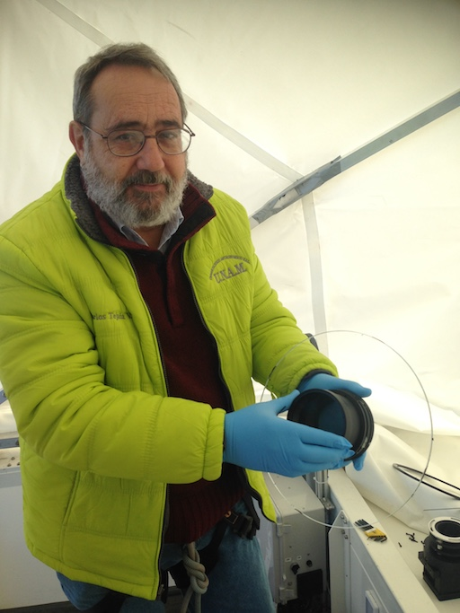
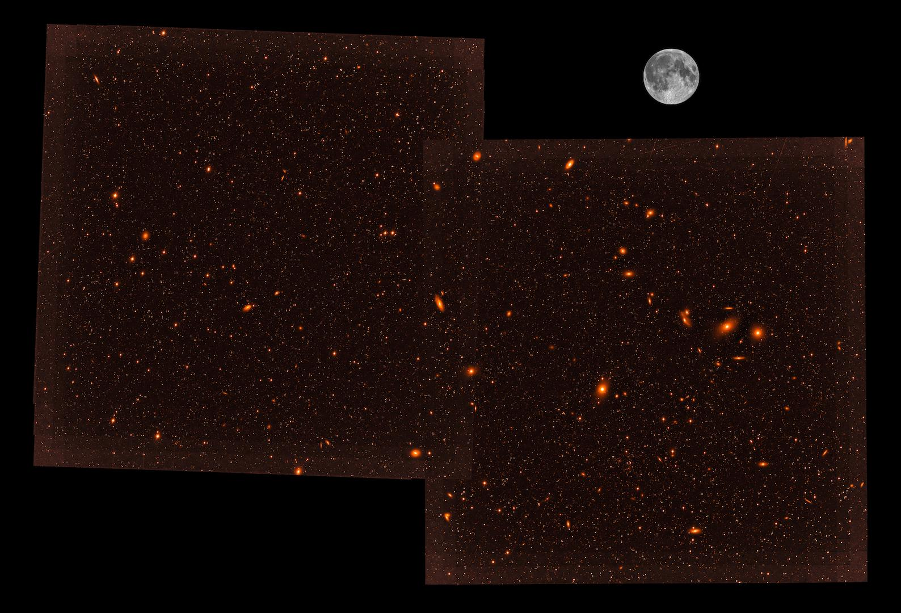
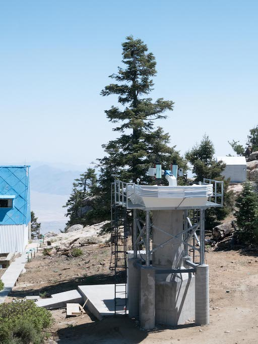

# DDOTI: News for 2019

* [DDOTI/OAN Observations and Detection of GRB 180914B](#20180918)
* [DDOTI/OAN First Science Observations](#20180306)
* [DDOTI/OAN C0 Failure](#20180213)
* [DDOTI/OAN Engineering Run](#20180126)
* [DDOTI/OAN Open after the Winter Break](#20180108)

<a name="20180918"/>
## DDOTI/OAN Observations and Detection of GRB 180914B

18 September 2018

DDOTI/OAN observed the Fermi/LAT GRB 180914B, detecting it on the nights
of 16 and 17 September 2018 and confirming fading from <i>w</i> = 19.5
to <i>w</i> = 20.3. We reported our results in a [GCN
Circular](https://gcn.gsfc.nasa.gov/gcn3/23253.gcn3)

<a name="20180306"/>
## DDOTI/OAN First Science Observations

6 March 2018

We took our first science data with DDOTI/OAN last night, observing the field of the LAT GRB 180305A ([Axelsson et al. 2018](https://gcn.gsfc.nasa.gov/gcn3/22457.gcn3)). 

We achieved a 10&sigma; limiting magnitude of about <i>w</i> = 20.1 in about three hours during twilight and bright time. This was not enough to detect the afterglow, which was at about <i>r</i> = 22.0 according to our simultaneous RATIR observations ([Troja et al. 2018](https://gcn.gsfc.nasa.gov/gcn3/22460.gcn3)). We observed about 18 hours after trigger and during twilight and bright time, so our non-detection is not too surprising. Nevertheless, these observations show that we are making good progress and are achieving useful sensitivity for younger and brighter afterglows.

<a name="20180213"/>
## DDOTI/OAN C0 Failure

13 February 2018

We've had two failures with C0 at DDOTI/OAN: the shutter is intermittently not closing completely and there has been some sort of failure in the focus mechanism and we can't focus. We hope to fix these when Carlos is next at the observatory from 21 March.

In the meantime we are observing with C1.

<a name="20180126"/>
## DDOTI/OAN Engineering Run

26 January 2018

Alan Watson and Fernando Quirós installed new network and control
hardware at DDOTI/OAN to better handle the quantity of data produced by
the large-format CCDs. Alan Watson and Carlos Tejada repaired, cleaned,
and aligned C1, the second telescope and CCD.

Carlos with the C1 Telescope Corrector Plate.

<a name="20180108"/>
## DDOTI/OAN Open after the Winter Break

8 January 2018

The OAN has resumed operations after the winter break. DDOTI/OAN has opened again.

<a name="20171214b"/>
## DDOTI/OAN Presented at "Deciphering the Violent Universe"

14 December 2017

Rosa Becerra-Godínez gave an oral presentation on DDOTI/OAN (and [COATLI](http://coatli.astroscu.unam.mx)) at the
"[Deciphering the Violent Universe](http://www.nucleares.unam.mx/dvu/index.html)" conference.

<a name="20171214a"/>
## DDOTI/OAN Closed for the Winter Break

14 December 2017

The OAN ceases operations for three weeks over Christmas and New Year.
DDOTI/OAN closed today and will reopen in the week of 8 January 2018.

<a name="20171207"/>
## DDOTI/OAN Can Now Close in the Cold

7 December 2017

We believe we have finally fixed a problem that caused the DDOTI/OAN
enclosure to fail to close at low temperatures.

The DDOTI/OAN enclosure was mistakenly shipped with standard oil in the
gearboxes and small capacitors on the motors. This caused it
to fail to close below +10&nbsp;C. We replaced the oil with a local
low-temperature oil and larger capacitors, but the enclosure would still
fail to close below +5&nbsp;C. This obviously caused significant
restrictions on robotic operations and impeded commissioning.

Over the last few days, we installed special low-temperature oil and
special larger capacitors sent by the manufacturer, and tonight were
able to successfully close at &minus;6&nbsp;C! We hope the problem is now
solved.

<a name="20171026"/>
## DDOTI/OAN Optical Alignment

26 October 2017

We have aligned one of the tubes of DDOTI/OAN using a prototype tip-tilt adapter designed by Alex Farah. This is necessary because the telescope beam is fast (<i>f</i>/2.2) and the detector is large (37 mm square). The tube now gives uniform images with 2 pixel FWHM (4 arcsec) over the whole field of view. To demonstrate this, we show below a 60 second image of the [Andromeda Galaxy M31](https://en.wikipedia.org/wiki/Andromeda_Galaxy) and its [satellite galaxies](https://en.wikipedia.org/wiki/List_of_Andromeda%27s_satellite_galaxies) [M32](https://en.wikipedia.org/wiki/Messier_32) and [M110](https://en.wikipedia.org/wiki/Messier_110). 

M31 and its satellites M32 and M110 imaged by DDOTI after optical alignment.

<a name="20171013"/>
## DDOTI in *Nature News*

13 October 2017

Davide Castelvecchi has written a [*Nature News* article](https://www.nature.com/news/global-networks-of-small-telescopes-will-chase-companion-signals-of-gravitational-waves-1.22828) on DDOTI and other telescopes dedicated to the search for the optical counterparts of gravitational wave events.

<a name="20170630"/>
## DDOTI/OAN First-Light

30 June 2017

We gave a press conference to announce first-light with DDOTI/OAN! DDOTI/OAN was operating with only
two tubes, but even so the combined field was about 23 square degrees. 

The first-light image with DDOTI/OAN showing M87
and other galaxies in the Virgo Cluster. This image was taken with two
tubes, each with a field of 3.4 degrees to a side. The final imager will
have a field that is three times larger. The moon is shown to give an
idea of the scale.

The two DDOTI/OAN tubes at about the time of first light.

The DDOTI/OAN tower at about the time of first light.

First-light was the result of the work of many people, including:
Fernando Ángeles,
Rosa Becerra, 
Tülin Bedel,
Nathaniel Butler,
Alejandro Farah,
Manuel González, 
Josef Huber,
William Lee,
Liliana Figueroa,
Fernando Quirós,
Carlos Román-Zúñiga,
Carlos Tejada,
and
Alan Watson.

For more details (in Spanish), see:

* [Press Conference](https://www.youtube.com/watch?v=u9MjoTKfqbo)
* [Instituto de Astronomía Press Release](http://www.astroscu.unam.mx/IA/images/COMUNICACION/DDOTI-FINAL.pdf)
* [UNAM Press Release](http://www.dgcs.unam.mx/boletin/bdboletin/2017_451.html)

First-light was reported by the Mexican press, including:

* [La Jornada](http://ciencias.jornada.com.mx/2017/07/01/tiene-unam-nueva-herramienta-para-observar-el-cosmos-5288.html)
* [MVS](http://www.mvsnoticias.com/?_escaped_fragment_=/noticias/participa-mexico-en-proyecto-para-rastrear-rayos-gamma-y-ondas-gravitacionales-140#!)

<a name="20170606"/>
## DDOTI/OAN Installation

6 June 2017

Members of the DDOTI team, along with Josef Huber and Tülin Bedel of
[ASTELCO Systems GmbH](http://www.astelco.com/), have begun the installation of the DDOTI/OAN tower, enclosure,
mount, and first two tubes.