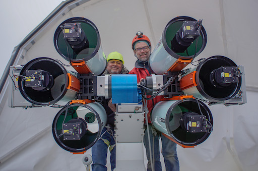

# DDOTI: News for 2019

* [DDOTI/OAN Closed for the Winter Break](#20191222)
* [DDOTI/OAN Observations of the LIGO/Virgo Source S190521g](#20190521)
* [DDOTI/OAN Observations of the LIGO/Virgo Source S190426c](#20190428)
* [DDOTI/OAN Observations of the LIGO/Virgo Source S190408an](#20190409)
* [DDOTI/OAN Installation of All Six Telescopes](#20190321)
* [DDOTI/OAN Observations and Possible Detection of GRB 190129B](#20190130)

<a name="20191222"/>
## DDOTI/OAN Closed for the Winter Break

22 December 2019

DDOTI/OAN has closed for the OAN winter break. Most of the other
telescopes were closed on 14 December, but for the first time DDOTI,
COATLI, and SAINT-EX stayed open longer under the care of a skeleton
crew. We thank Ilse Plauchu and Rosa Becerra for technical support in
this period.

<a name="20190521"/>
## DDOTI/OAN Observations of the LIGO/Virgo Source S190521g

21 May 2019

DDOTI/OAN observed a 14 by 21 degree region (294 square degrees)
centered on the probability peak of the [LIGO/Virgo source
S190521g](https://gcn.gsfc.nasa.gov/gcn3/24621.gcn3), a candidate binary
black-hole merger. We detect no uncataloged sources with significant
fading down to our 10-sigma limit of 18.7 magnitude. We reported our
observations in a [GCN
Circular](https://gcn.gsfc.nasa.gov/gcn3/24644.gcn3)

<a name="20190428"/>
## DDOTI/OAN Observations of the LIGO/Virgo Source S190426c

28 April 2019

DDOTI/OAN observed a 460 square degrees centered on the probability peak
of the [LIGO/Virgo source
S190426c](https://gcn.gsfc.nasa.gov/gcn3/24237.gcn3), a candidate binary
neutron-star merger. We reported our observations in a [GCN
Circular](https://gcn.gsfc.nasa.gov/gcn3/24310.gcn3)

<a name="20190409"/>
## DDOTI/OAN Observations of the LIGO/Virgo Source S190408an

9 April 2019

DDOTI/OAN observed an 11 by 7 degree region (70 square degrees) centered
on the probability peak of the [LIGO/Virgo source
S190408an](https://gcn.gsfc.nasa.gov/gcn3/24069.gcn3), a candidate
binary black-hole merger. We reported our observations in a [GCN
Circular](https://gcn.gsfc.nasa.gov/gcn3/24086.gcn3)

<a name="20190321"/>
## DDOTI/OAN Installation of All Six Telescopes

21 March 2019

DDOTI/OAN has been observing with two telescopes since the summer of
2017. We have now installed the four remaining telescope to give a full
complement of six telescopes. The additional telescopes are a major hardware
contribution from the University of Maryland group lead by Nora Troya
and Alexander Kutyrev. 

The installation was carried out by Fernando
Ángeles, Alejandro Farah, Diego González, Margarita Pereyra, and Alan
Watson with help from the staff of the Observatorio Astronómico
Nacional.

Fernando Ángeles (left) and Alan Watson (right) with all six telescopes.

<a name="20190130"/>
## DDOTI/OAN Observations and Possible Detection of GRB 190129B

30 January 2019

DDOTI/OAN observed the entire IPN error box of GRB 190129B and detected
a faint, apparently fading source which we suggest is the afterglow. We
reported our results in a [GCN
Circular](https://gcn.gsfc.nasa.gov/gcn3/23820.gcn3)
