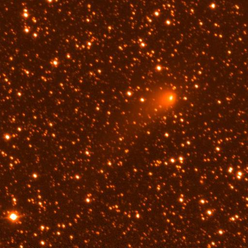

# DDOTI: News

## 2020

* [DDOTI DDOTI Closed Again Due to COVID-19](#20201208)
* [DDOTI Open Again](#20201121)
* [DDOTI Second Paper on GW190814 Accepted!](#20201022)
* [DDOTI Closed due to COVID-19](#2020321)
* [DDOTI Observations of LIGO/Virgo S200213t](#20200114b)
* [DDOTI Observations of GRB 200125B](#20200128)
* [DDOTI Observations of GRB 200115A](#20200115)
* [DDOTI Observations of LIGO/Virgo S200114f](#20200114b)
* [DDOTI Paper on S190814bv Accepted!](#20200114a)
* [DDOTI Open after the Winter Break](#20200106)

## Older News

* [2019](news-2019.html)
* [2018](news-2018.html)
* [2017](news-2017.html)

<a name="20201208">
## DDOTI Closed Again Due to COVID-19

08 December 2020

The government of Baja California has changed the COVID-19 alert level from orange to red. As a result, the Observatorio Astronómico Nacional is again being shut down and evacuated. DDOTI will be closed until further notice.

We observed on 16 of the 17 nights that DDOTI was able to open and produced five GCN Circulars on Fermi and Swift GRBs.

<a name="20201121">
## DDOTI Open Again

21 November 2020

After eight long months, the Observatorio Astronómico Nacional and DDOTI are
open again.

<a name="20201022"/>
## DDOTI Second Paper on GW190814 Accepted

22 October 2020

Our second
[paper](https://ui.adsabs.harvard.edu/abs/2020MNRAS.499.3868T/abstract) on
limits on the counterpart to LIGO/Virgo GW190814 has been accepted by MNRAS.
This paper builds on our [earlier paper](#20200114a) with an improved pipeline,
image subtraction, and additional epochs to give DDOTI limits that are about
1 mag deeper. It also includes DCT and GTC observations of counterparts.

<a name="20200321">
## DDOTI Closed Due To COVID-19

21 March 2020

The Observatorio Astronómico Nacional is being shut down and evacuated due to
the risk of COVID-19. DDOTI will be closed until further notice.

<a name="2020213"/>
## DDOTI Observations of LIGO/Virgo S200213t

13 February 2020

DDOTI observed 200 square degrees 
centered on the probability peak of [LIGO/Virgo 
S200213t](https://gcn.gsfc.nasa.gov/gcn3/27042.gcn3), a candidate binary
neutron-star merger. We detect no uncataloged sources down to our 10-sigma
limit of magnitude 18.7 to 19.2. We reported our observations in a [GCN
Circular](https://gcn.gsfc.nasa.gov/gcn3/27061.gcn3).

By chance, Comet C/2017 T2 fell in our observations, and caused us a
momentary fright when it showed up as a magnitude 12 source in our
analysis pipeline!

Comet C/2017 T2 Captured by DDOTI (20 &times 20 arcmin).

<a name="20200128"/>
## DDOTI Observations of GRB 200125A

28 January 2020

DDOTI observed a 6.8 by 10.2 degree region (69 square degrees)
centered on the probability peak of the Fermi/GBM [GRB  
200125B](https://gcn.gsfc.nasa.gov/gcn3/26879.gcn3). We detect no uncataloged sources down to our 10-sigma
limit of magnitude 20.0. We reported our observations in a [GCN
Circular](https://gcn.gsfc.nasa.gov/gcn3/26911.gcn3).

<a name="20200115"/>
## DDOTI Observations of GRB 200115A

15 January 2020

DDOTI observed a 6.8 by 10.2 degree region (69 square degrees)
centered on the probability peak of the Swift/BAT [GRB  
200115A](https://gcn.gsfc.nasa.gov/gcn3/26771.gcn3). We detect no uncataloged sources down to our 3-sigma
limit of magnitude 19.8. We reported our observations in a [GCN
Circular](https://gcn.gsfc.nasa.gov/gcn3/26792.gcn3).

<a name="20190521"/>
## DDOTI Observations of LIGO/Virgo S200114f

14 January 2020

DDOTI observed a 13.6 by 20.4 degree region (277 square degrees)
centered on the probability peak of [LIGO/Virgo 
S200114f](https://gcn.gsfc.nasa.gov/gcn3/24621.gcn3), a candidate binary
black-hole merger. We detect no uncataloged sources down to our 10-sigma
limit of magnitude 18.9 to 19.5. We reported our observations in a [GCN
Circular](https://gcn.gsfc.nasa.gov/gcn3/26752.gcn3).

<a name="20200114a"/>
## DDOTI Paper on LIGO/Virgo S190814bv Accepted!

14 January 2020

Our
[paper](https://ui.adsabs.harvard.edu/abs/2020MNRAS.tmp..159W/abstract)
on DDOTI limits on the counterpart to LIGO/Virgo S190814bv has been
accepted by MNRAS! This is our first accepted science paper, so we will
be opening a bottle of something to celebrate!

<a name="20200106"/>
## DDOTI Open after the Winter Break

6 January 2020

The OAN has resumed operations after the winter break. DDOTI has opened again.
